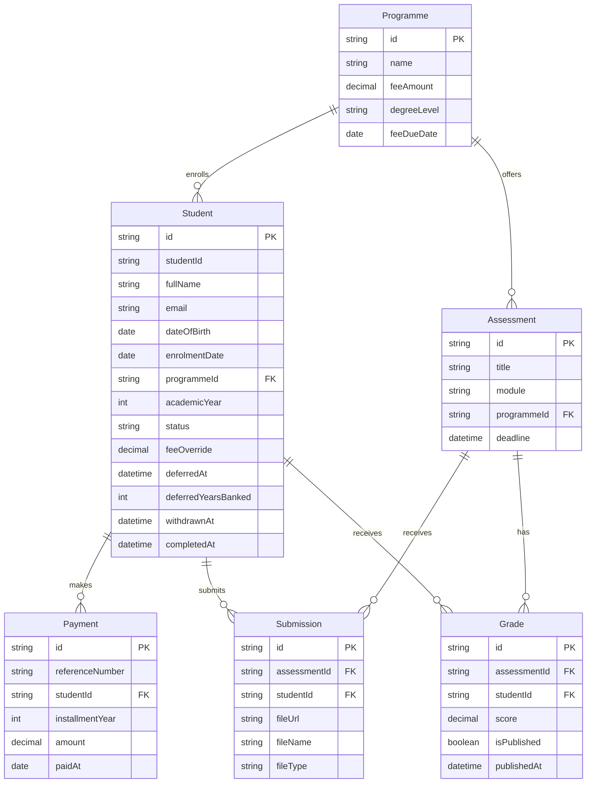

# Student Management System: Registry Module

A technical assessment submission for PEN Global, built with Claude Code as a pair-programmer (see [AI_USAGE.md](AI_USAGE.md)).

The brief asks for the four workflows a Registry Administrator uses every day, not a full platform. This covers exactly that: enrolling and managing students, tracking fees and payments, students submitting work against staff-created assessments, and staff grading with publish/withhold control over results, plus the role separation (staff vs. student) and edge cases (overdue fees, late submissions, deferred/withdrawn students, withheld results) needed for it to behave like a real registry system rather than a happy-path demo.

## What's Built

**1. Student Enrolment**: create/edit student records (name, email, DOB, programme, academic year, enrolment status), auto-generated Student IDs (`SMS-<year>-<0001>`), search and filter by name, ID, programme, or status, and hard delete for genuinely mistaken entries.

**2. Fees & Payments**: a fee per programme (with an optional per-student override), billed in installments anchored to each student's own enrolment date, real-time outstanding balance, and overdue flagging on the Registry dashboard.

**3. Assessment Submission**: staff create assessments (title, module, deadline); students upload a PDF/DOCX against an open one. One submission per student per assessment, resubmission allowed up to the deadline, late submissions accepted but flagged.

**4. Marksheet & Results**: staff enter a numeric grade per student per assessment with automatic Pass/Merit/Distinction classification, and publish or withhold each result individually. Students only ever see a published result.

Plus a plain-language `/policy` page explaining fees and enrolment-status rules for both roles, and every access rule enforced server-side, not just hidden in the UI.

## Tech Stack

- Next.js (App Router) + TypeScript
- PostgreSQL + Prisma ORM (via the `@prisma/adapter-pg` driver adapter)
- Zod for validation, shared between forms and API routes, plus React Hook Form for the forms themselves
- Tailwind CSS + shadcn/ui
- Vitest for unit tests

## Architecture

- **Server Components by default.** Pages fetch data directly through Prisma inside the component itself, no separate client-side fetching layer. Only the interactive pieces (forms, dialogs, filters) are Client Components, and they call the API routes below rather than touching Prisma directly.
- **API routes handle every mutation**: `src/app/api/{students,programmes,assessments,payments,grades}`, plus a nested `submissions` route for file upload. Each one re-validates with the same Zod schema the form used (client-side validation alone isn't trustworthy, a route can be hit directly) and enforces its own role rule server-side.
- **`src/lib/` holds the business logic**, independent of any route or page: `balance.ts` (installment billing and the deferral/withdrawal/completion rules), `classification.ts` (grade thresholds), `api-auth.ts` (`requireStaff` / `requireStaffOrSelf` / `requireSelf`), `serialize.ts` (converting Prisma's `Decimal` to a plain number before it crosses into a Client Component), and `session.ts` (the cookie-based role toggle).
- **Nothing derivable is stored.** Overdue status, late submissions, grade classification, installments due, and a deferred student's effective status are all computed at read time from raw dates and scores, not written to the database, so there's no scheduler needed to keep them correct as time passes.
- **Staff and student views share the same pages** (`/students/[id]`, `/assessments/[id]`, ...), rendered differently by role through conditional logic, rather than a separate route tree per role.

## Design System

Colors are CSS variables in `src/app/globals.css` (light/dark pairs: `--primary`, `--destructive`, `--success`, etc.), and components are shadcn/ui primitives owned in `src/components/ui/`. Feature code always uses these shared tokens/components rather than one-off styling.

## Getting Started

```bash
# 1. Install dependencies
npm install

# 2. Copy environment variables (defaults already match docker-compose.yml)
cp .env.example .env

# 3. Start PostgreSQL
docker compose up -d

# 4. Apply the schema and generate the Prisma Client
npx prisma migrate dev

# 5. Seed demo data
npx prisma db seed

# 6. Run the dev server
npm run dev
```

Open [http://localhost:3000](http://localhost:3000).

## Testing

```bash
npm test
```

Unit tests cover `src/lib/balance.ts` and `src/lib/classification.ts`: the installment billing, deferral/withdrawal effective-date and grace-period math, and grade classification thresholds. This is the app's most complex (and, during the build, most bug-prone) logic, so it's what got automated tests; everything route/role/UI-level was instead verified live against a running instance with curl (see [AI_USAGE.md](AI_USAGE.md)).

## Environment Variables

| Variable | Description |
|---|---|
| `DATABASE_URL` | PostgreSQL connection string. Default in `.env.example` matches the `docker-compose.yml` Postgres container out of the box. |

## Data Model



Maintained by hand in this README alongside `schema.prisma`. Renders natively on GitHub, or in an editor with Mermaid preview support.

## Design Decisions

**Enrolment & students**
- A student belongs to exactly one programme at a time (no double majors/transfers), scoped out given the brief's own "their programme" wording and timeframe.
- `academicYear` is staff-set, not derived from enrolment date (a retake can repeat a year), capped server- and client-side to the programme's degree length (4 Bachelor's / 2 Master's).
- New students default to today's enrolment date, still editable for a backdated entry.
- Hard delete is real but Postgres-safeguarded: a student with any payment, submission, or grade on record can't be deleted, only set to `WITHDRAWN`. Delete is for fixing mistaken entries, not real departures.

**Fees & payments**
- `feeOverride` replaces a student's total programme fee outright (still split evenly across installments), rather than a full scholarship/discount subsystem.
- Fees bill in installments, one per year of study (4 Bachelor's / 2 Master's), anchored to each student's own `enrolmentDate`, not a shared programme due date, since students in the same programme can start at different times.
- "Overdue" means behind on installments actually due by now, not behind on the total remaining fee; both are shown separately.
- Payments are picked by installment year (not a free-form amount), computed server-side, and capped so a student can never pay past their total fee.
- Online "Make a Payment" is a dummy, no real gateway. Payments generally are ordinary editable/deletable records, not an immutable ledger.

**Deferred, withdrawn, completed**
- Deferral takes effect the next 1 January (not immediately), freezes the fee schedule for one year from that point, then resumes, permanently shifting the whole schedule out by a year rather than the student catching back up. `deferredYearsBanked` lets a second, later deferral still compound correctly with an already-resolved earlier one.
- Withdrawal follows the same next-Jan-1 effective date, but the freeze is permanent, no resuming.
- Both statuses are read live, not just stored: a resolved deferral shows the student as `ENROLLED` again everywhere automatically (`effectiveStatus` in `balance.ts`), since the app has no scheduler to flip it back.
- A student can't be marked `Completed` while an overdue balance remains. Once completed, assessments due after their graduation year stop appearing entirely, even a direct link 404s.

**Assessments & grading**
- Assessments are scoped to a programme, not a specific module registration; every student in a programme is assumed to take every module (no electives/prerequisites modelled).
- One submission per student per assessment; resubmission is allowed up to the deadline, then locked. Staff see "Resubmitted" / "Resubmitted after grading" flags, since overwriting the file leaves no other trace.
- Grades are `Decimal` (half points matter for exact Pass ≥ 40 / Merit ≥ 60 / Distinction ≥ 70 thresholds); classification is computed at read time, never stored.
- Publish/withhold is per grade, not per student, so staff can release results assessment-by-assessment as grading finishes.
- Ungraded work is surfaced everywhere staff would look for it: dashboard, assessments list, and assessment detail, all from one shared definition.

**Access & roles**
- Role separation is a cookie-based toggle, not real authentication, per the brief's own "a simple role toggle is fine" allowance.
- Every mutation route enforces its role rule server-side (shared `requireStaff` / `requireStaffOrSelf` / `requireSelf` helpers), not just hidden in the UI, verified directly with curl, not just by checking a button is missing.
- Staff and student views share the same pages (e.g. `/students/[id]`), rendered differently by role, rather than separate route trees.

## Known Limitations

- No multi-programme support (double majors, transfers).
- No `Module` entity: no per-module registration, electives, or prerequisites, only programme-level scoping.
- Payments have no audit trail; staff can directly edit or delete a recorded payment.
- Submitted files live on local disk (`public/uploads/`) and are reachable by anyone with the URL. A real deployment needs object storage with signed URLs.
- The role toggle is not real authentication. A real deployment needs actual login.
- Student ID generation (max + increment) isn't concurrency-safe; accepted as low-risk for a single-registry-team tool.
- No certificate workflow: `Completed`'s "contact the registry for a certificate" is policy text only.

## AI Usage

Built with Claude Code as a pair-programmer throughout: scaffolding, schema design, every API route and UI, and debugging. Product and scope decisions (what to build, what to deliberately leave out, how to read ambiguous spec wording) stayed with the developer; Claude proposed implementations and flagged edge cases, and almost nothing was accepted as working without being verified against a running instance rather than just reading the code back.

See [AI_USAGE.md](AI_USAGE.md) for the fuller picture: the tools and workflow, how instructions were given, and how the app was tested.
