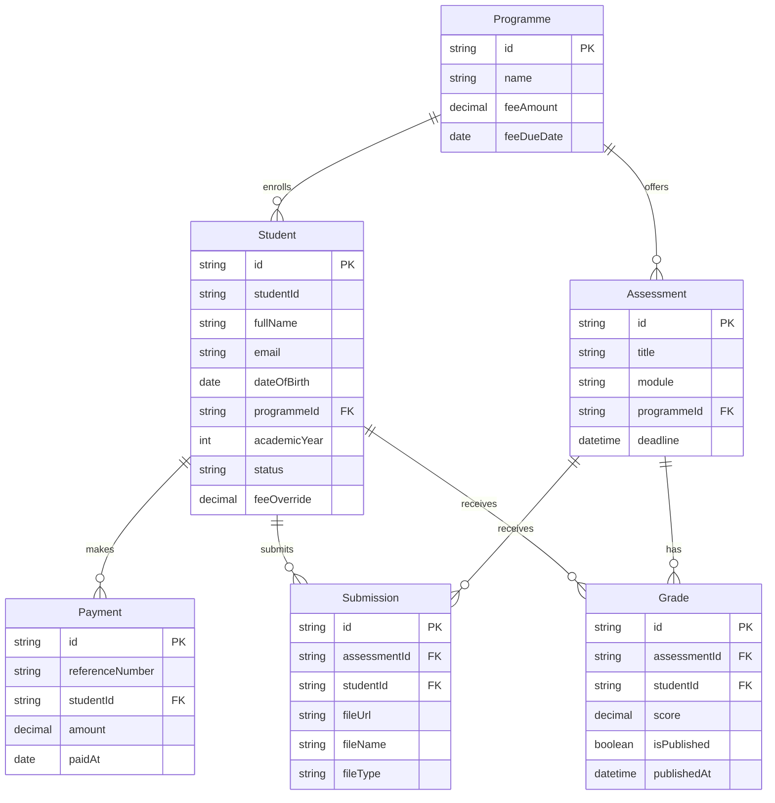

# Student Management System : Registry Module

Technical assessment submission for PEN Global, covering the Registry module: student enrolment, fees & payments, assessment submission, and marksheet & results.

## Tech Stack

- Next.js (App Router) + TypeScript
- PostgreSQL + Prisma ORM (via the `@prisma/adapter-pg` driver adapter)
- Tailwind CSS
- shadcn/ui

## Design System

- **Colors** are centralized as CSS variables in `src/app/globals.css` (`--primary`, `--destructive`, `--success`, `--warning`, `--info`, etc.), each with a light and dark value. Components reference these tokens (`bg-success`, `text-warning-foreground`, ...) rather than hardcoded colors, so retuning a color is a one-line change.
- **Components** are shadcn/ui primitives owned in `src/components/ui/` (e.g. `Button`, `Badge`), each defining every visual variant once via `cva`. Feature code always imports these shared components rather than styling one-off buttons/badges per page.

## Data Model



This diagram is maintained by hand in this README and updated as models are added. To view it, open this file on GitHub (renders natively) or in an editor with Mermaid preview support (e.g. the Markdown Preview Mermaid Support extension in VS Code).

## Design Decisions & Known Limitations

- **One programme per student.** A student can only be enrolled in a single programme at a time. In reality, students sometimes hold multiple programmes (double majors, transfers) — this is a deliberate scope simplification given the assessment's timeframe and the spec's literal wording ("their programme"), not an oversight. Modeling it properly would require scoping fees, assessments, and grades per-programme-per-student rather than per-student, which is a structural change we're choosing not to take on now.
- **`feeOverride` instead of a scholarship/financial-aid system.** Students can have an optional per-student fee override (discount, aid, scholarship) via a single nullable field, rather than a full application/approval workflow. This covers the common case ("this student doesn't pay the standard rate") without building an entire subsystem the spec doesn't ask for.
- **`academicYear` is staff-editable, not derived.** It represents year of study (1st/2nd/3rd...), not intake year, and isn't computed from enrolment date because a retake can put a student in the same academic year across two sessions.
- **Payment reference numbers are auto-generated, not staff-entered.** This app doesn't integrate with a real payment gateway or bank, so there's no external reference number flowing in from anywhere to capture. The system generates its own (e.g. `PMT-2026-000001`), which sidesteps staff typos and uniqueness conflicts entirely.
- **Payments are ordinary CRUD, not an accounting ledger.** Staff can edit or delete a recorded payment directly to fix a mistake. A real accounting system would use immutable entries with reversal/adjustment records to preserve a full audit trail instead of allowing direct edits — that's out of scope here given the assessment's timeframe.
- **"Overdue" is defined per-programme, not per-student or by enrolment date.** A balance is overdue when it's greater than zero and today is past that programme's `feeDueDate`. A programme with no due date set never flags its students as overdue, rather than defaulting to always/never overdue silently.
- **Assessments are scoped to a programme, not a specific module registration.** `Assessment.programmeId` restricts submission eligibility to students in that programme. This is a real gap we chose not to close: a full implementation would need a separate `Module` entity, a student-to-module registration record (since not every student in a programme takes every module, electives and exemptions exist), and module prerequisites (e.g. can't take "Algorithms II" without passing "Data Structures"). All three are out of scope here, since building them would mean a new registration workflow beyond the four described in the assessment, not just a schema addition.
- **Deadlines are full timestamps, not dates.** `Assessment.deadline` includes a time of day, since whether a submission is "late" depends on an exact cutoff, unlike, say, date of birth where time of day is meaningless.
- **Resubmission overwrites the existing record.** `Submission` has a unique constraint on `(studentId, assessmentId)`, so a resubmission updates the same row (new file, new timestamp) rather than preserving every past attempt. No submission history/versioning is kept.
- **Grades use `Decimal`, not `Int`, and allow half points.** Classification thresholds (Pass ≥ 40, Merit ≥ 60, Distinction ≥ 70) need exact comparisons, so floating point isn't safe here, same reasoning as money fields. A score under 40 is treated as an implicit **Fail**, which the spec doesn't name but leaves as the obvious remaining case. Classification itself is computed from the score at read time, never stored.
- **Publish/withhold is per grade, not per student.** Staff can publish or withhold each (student, assessment) result independently, rather than one switch revealing or hiding a student's entire marksheet at once. The spec's wording ("per student") was ambiguous here; this reading was chosen because it lets staff publish results assessment by assessment as grading finishes, which is how a Registry would realistically operate.
- **No hard delete for students.** Removing a student record entirely isn't supported; `WITHDRAWN` status represents a student leaving instead. Hard delete would either cascade-delete their whole payment/submission/grade history or leave it orphaned, and the enrolment statuses already give a clean way to represent departure.
- **Student ID generation has an accepted race condition.** The next `SMS-<year>-XXXX` id is computed by reading the current max and incrementing, not via a dedicated database sequence. Two simultaneous student creations could theoretically compute the same id. Given this is a single-registry-team internal tool rather than a high-concurrency system, this risk is accepted rather than engineered around.
- **Submitted files are stored on local disk (`public/uploads/`), not object storage.** No S3/Vercel Blob integration exists; files are saved directly to the filesystem with a UUID-based name, and metadata (original filename, type) is stored in Postgres. This is a pragmatic choice for an app running locally rather than deployed at scale, but it also means files are served without any access control, anyone with a submission's URL can view it. A production version would use signed URLs from private object storage instead.
- **Role separation is a cookie-based toggle, not real authentication.** Per the spec ("auth optional – a simple role toggle is fine"), there's no login, password, or session expiry. A cookie stores either `{ role: "STAFF" }` or `{ role: "STUDENT", studentId }`, switched via the nav bar. This is not a security boundary, anyone can still hit the API routes directly, only the UI's page-level checks respect it. A production version would need real authentication behind these same access rules.
- **Staff and student views share the same pages, gated by conditional rendering.** Rather than build a separate route tree, `/students/[id]` and `/assessments/[id]` render differently depending on the session's role (edit controls, the full submissions/grades list, and management actions are staff-only; a student sees a read-only version of just their own data). A student attempting to view another student's page, or the shared list/dashboard pages, is redirected back to their own profile.
- **Students only see assessments for their own programme, and only their own submission on each one**, matching the same programme-scoping decision made for submission eligibility. Grading and publish/withhold controls are staff-only and hidden entirely from the student view.

## Getting Started

```bash
# 1. Install dependencies
npm install

# 2. Copy environment variables (defaults already match docker-compose.yml)
cp .env.example .env

# 3. Start PostgreSQL
docker compose up -d

# 4. Apply the schema and generate the Prisma Client
npx prisma migrate dev

# 5. Seed demo data
npx prisma db seed

# 6. Run the dev server
npm run dev
```

Open [http://localhost:3000](http://localhost:3000).

## Environment Variables

| Variable | Description |
|---|---|
| `DATABASE_URL` | PostgreSQL connection string. Default in `.env.example` matches the `docker-compose.yml` Postgres container out of the box. |

## AI Usage

This project was built with Claude Code as a collaborative pair-programmer. See [AI_USAGE.md](AI_USAGE.md) for the full step-by-step log of what was AI-assisted and what was manually reviewed/decided.
