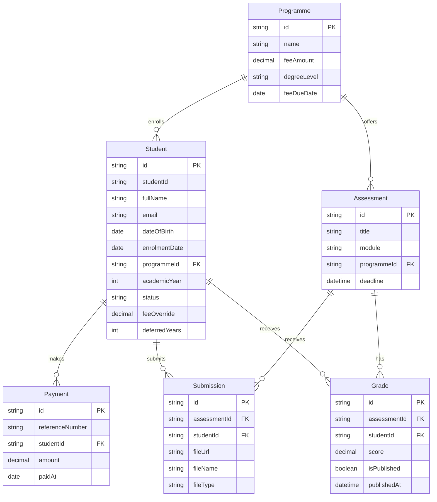

# Student Management System : Registry Module

Technical assessment submission for PEN Global, covering the Registry module: student enrolment, fees & payments, assessment submission, and marksheet & results.

## Tech Stack

- Next.js (App Router) + TypeScript
- PostgreSQL + Prisma ORM (via the `@prisma/adapter-pg` driver adapter)
- Tailwind CSS
- shadcn/ui

## Design System

- **Colors** are centralized as CSS variables in `src/app/globals.css` (`--primary`, `--destructive`, `--success`, `--warning`, `--info`, etc.), each with a light and dark value. Components reference these tokens (`bg-success`, `text-warning-foreground`, ...) rather than hardcoded colors, so retuning a color is a one-line change.
- **Components** are shadcn/ui primitives owned in `src/components/ui/` (e.g. `Button`, `Badge`), each defining every visual variant once via `cva`. Feature code always imports these shared components rather than styling one-off buttons/badges per page.

## Data Model



This diagram is maintained by hand in this README and updated as models are added. To view it, open this file on GitHub (renders natively) or in an editor with Mermaid preview support (e.g. the Markdown Preview Mermaid Support extension in VS Code).

## Design Decisions & Known Limitations

- **One programme per student.** A student can only be enrolled in a single programme at a time. In reality, students sometimes hold multiple programmes (double majors, transfers) — this is a deliberate scope simplification given the assessment's timeframe and the spec's literal wording ("their programme"), not an oversight. Modeling it properly would require scoping fees, assessments, and grades per-programme-per-student rather than per-student, which is a structural change we're choosing not to take on now.
- **`feeOverride` instead of a scholarship/financial-aid system.** Students can have an optional per-student fee override (discount, aid, scholarship) via a single nullable field, rather than a full application/approval workflow. This covers the common case ("this student doesn't pay the standard rate") without building an entire subsystem the spec doesn't ask for.
- **`academicYear` is staff-editable, not derived.** It represents year of study (1st/2nd/3rd...), not intake year, and isn't computed from enrolment date because a retake can put a student in the same academic year across two sessions.
- **Payment reference numbers are auto-generated, not staff-entered.** This app doesn't integrate with a real payment gateway or bank, so there's no external reference number flowing in from anywhere to capture. The system generates its own (e.g. `PMT-2026-000001`), which sidesteps staff typos and uniqueness conflicts entirely.
- **Payments are ordinary CRUD, not an accounting ledger.** Staff can edit or delete a recorded payment directly to fix a mistake. A real accounting system would use immutable entries with reversal/adjustment records to preserve a full audit trail instead of allowing direct edits — that's out of scope here given the assessment's timeframe.
- **Fees are billed in installments, one per year of study, not as a single lump sum.** A Bachelor's programme splits its fee into 4 installments (`degreeLevel: BACHELORS`), a Master's into 2 (`MASTERS`). This exists because a flat "pay the whole programme fee once" model doesn't reflect how tuition is actually charged, and doesn't account for a student progressing to their next academic year at all.
- **Each student's installment schedule is anchored to their own `enrolmentDate`, not a single shared programme due date.** Two students in the same programme can have started at completely different times, so `Programme.feeDueDate` only acts as an on/off switch for whether overdue tracking applies to that programme at all (null = never overdue, e.g. for a programme with no formal fee schedule); the actual per-installment due dates are computed per student as one year after the last, starting from their own enrolment date.
- **"Overdue" means behind on installments actually due by now, not behind on the full fee.** A student who has paid more than what's cumulatively due for their current year isn't overdue, even if they haven't paid the programme's full fee yet, that portion isn't due yet. Conversely, a student who has paid a lot up front can still show as "not overdue" while genuinely owing money overall, since the overdue flag only reflects the installment schedule, not the total remaining balance (both are shown separately in the UI).
- **Assessments are scoped to a programme, not a specific module registration.** `Assessment.programmeId` restricts submission eligibility to students in that programme. This is a real gap we chose not to close: a full implementation would need a separate `Module` entity, a student-to-module registration record (since not every student in a programme takes every module, electives and exemptions exist), and module prerequisites (e.g. can't take "Algorithms II" without passing "Data Structures"). All three are out of scope here, since building them would mean a new registration workflow beyond the four described in the assessment, not just a schema addition.
- **The assessments list is grouped by module**, one card per module rather than one flat table across every subject. `module` is still a plain text field, not its own entity (see the module-registration limitation above), grouping is a display-only change, students still only see modules within their own programme.
- **Deferred students' fee schedules shift by a flat one year per deferral, not by tracking real deferral start/end dates.** `Student.deferredYears` counts how many times a student has deferred; each is assumed worth exactly one year, so a Bachelor's student who defers once ends up on a 5-year schedule instead of 4 (still 4 installments, just spread out further), permanently, not just paused while currently deferred. It's incremented automatically in the students API route whenever status actually transitions into `DEFERRED` from something else (not on every unrelated edit to an already-deferred student, which would double-count), and isn't directly staff-editable. This is a deliberate simplification given the assessment's timeframe: a real system would track actual deferral periods rather than assume a flat year each time.
- **Deadlines are full timestamps, not dates.** `Assessment.deadline` includes a time of day, since whether a submission is "late" depends on an exact cutoff, unlike, say, date of birth where time of day is meaningless.
- **Resubmission overwrites the existing record.** `Submission` has a unique constraint on `(studentId, assessmentId)`, so a resubmission updates the same row (new file, new timestamp) rather than preserving every past attempt. No submission history/versioning is kept. Since overwriting erases any visible trace of a resubmission, staff see a computed **"Resubmitted"** badge whenever `createdAt` and `updatedAt` differ, and a **"Resubmitted after grading"** badge instead when the resubmission happened after the existing grade was last saved, since that grade may no longer reflect the file it was actually graded against. On the student's side, the submit form itself shows their current file name and submission date before they resubmit (warning that it'll be replaced, and that an existing grade may go stale), plus a confirmation message once the upload succeeds.
- **Grades use `Decimal`, not `Int`, and allow half points.** Classification thresholds (Pass ≥ 40, Merit ≥ 60, Distinction ≥ 70) need exact comparisons, so floating point isn't safe here, same reasoning as money fields. A score under 40 is treated as an implicit **Fail**, which the spec doesn't name but leaves as the obvious remaining case. Classification itself is computed from the score at read time, never stored.
- **Publish/withhold is per grade, not per student.** Staff can publish or withhold each (student, assessment) result independently, rather than one switch revealing or hiding a student's entire marksheet at once. The spec's wording ("per student") was ambiguous here; this reading was chosen because it lets staff publish results assessment by assessment as grading finishes, which is how a Registry would realistically operate.
- **Payments can't push a student past their fee.** Both recording a new payment and editing an existing one are rejected if the total would exceed what's owed, whether attempted by staff or by the student's own online payment. Once fully paid, the API refuses any further payment with a clear message rather than silently allowing a negative balance.
- **No hard delete for students.** Removing a student record entirely isn't supported; `WITHDRAWN` status represents a student leaving instead. Hard delete would either cascade-delete their whole payment/submission/grade history or leave it orphaned, and the enrolment statuses already give a clean way to represent departure.
- **Student ID generation has an accepted race condition.** The next `SMS-<year>-XXXX` id is computed by reading the current max and incrementing, not via a dedicated database sequence. Two simultaneous student creations could theoretically compute the same id. Given this is a single-registry-team internal tool rather than a high-concurrency system, this risk is accepted rather than engineered around.
- **Submitted files are stored on local disk (`public/uploads/`), not object storage.** No S3/Vercel Blob integration exists; files are saved directly to the filesystem with a UUID-based name, and metadata (original filename, type) is stored in Postgres. This is a pragmatic choice for an app running locally rather than deployed at scale, but it also means files are served without any access control, anyone with a submission's URL can view it. A production version would use signed URLs from private object storage instead.
- **Role separation is a cookie-based toggle, not real authentication.** Per the spec ("auth optional – a simple role toggle is fine"), there's no login, password, or session expiry. A cookie stores either `{ role: "STAFF" }` or `{ role: "STUDENT", studentId }`, switched via the nav bar. Since it's just a readable cookie rather than a signed session, anyone could set it to any student id themselves, there's no cryptographic guarantee they are who they claim. A production version would need real authentication (e.g. a signed session or JWT) behind these same access rules.
- **Every API mutation route enforces its role rule server-side, not just in the UI.** Creating/editing students and assessments, entering grades, and publish/withhold are staff-only; recording a payment is staff or the student themselves; submitting assessment work is the student themselves only, staff can no longer do this even via a direct API call. A shared `src/lib/api-auth.ts` helper (`requireStaff`, `requireStaffOrSelf`, `requireSelf`) is used consistently across every route, this was verified directly with curl (not just by checking the UI hides a button), including confirming a student can't spoof another student's id to submit or pay on their behalf.
- **Staff and student views share the same pages, gated by conditional rendering.** Rather than build a separate route tree, `/students/[id]` and `/assessments/[id]` render differently depending on the session's role (edit controls, the full submissions/grades list, and management actions are staff-only; a student sees a read-only version of just their own data). A student attempting to view another student's page, or the shared list/dashboard pages, is redirected back to their own profile.
- **Students only see assessments for their own programme, and only their own submission on each one**, matching the same programme-scoping decision made for submission eligibility. Grading and publish/withhold controls are staff-only and hidden entirely from the student view.
- **Students see their own result inline on both the assessments list and the assessment detail page**, not just on their profile's Marksheet. Each row/page shows "Not submitted," "Pending" (submitted but not yet graded, or graded but withheld), or the published score and classification. Staff instead see the cohort-wide submission count on the list and the full Grades entry table on the detail page, since those are the actions staff take, not a personal result to check.
- **The "can't submit" message names the actual reason, not always "wrong programme."** A student can be blocked from submitting for two independent reasons: their programme doesn't match the assessment, or their enrolment status isn't `ENROLLED`. Only `ENROLLED` can submit, being deferred, withdrawn, or completed all block it, regardless of whether the assessment window is still open, none of them mean the student is currently doing coursework. Each case gets its own message (wrong programme, deferred, withdrawn, or completed) rather than one generic "not enrolled" line, enforced identically in the API route and the page.
- **Programmes have their own list and detail pages** showing the standard year-wise fee breakdown (one installment per year of study, evenly split, with a running cumulative total), separate from any individual student's actual schedule. This is the programme-level version of the same even split `calculateStudentBalance` already computes per student, a student's real installment dates are still anchored to their own `enrolmentDate` and may use a `feeOverride` instead of the programme's standard fee, this page only shows the baseline. Programmes now have full staff-only Create/Edit (no delete, matching the no-hard-delete precedent set by Students and Assessments), via the same `Dialog` + `react-hook-form` + `Zod` pattern used everywhere else, enforced server-side through `requireStaff` on both `/api/programmes` and `/api/programmes/[id]`. Both roles can view the fee breakdown, since a programme's fee schedule isn't private student data, but the enrolled-student count is staff-only, cohort size isn't something a student needs to know, the same reasoning already applied to the "Submissions" count on the assessments list. `degreeLevel` is the one field that actually drives the x/4 vs x/2 installment split, everything else (the breakdown table, a student's own balance) already reads that field automatically, so the form itself needs no separate installment logic.
- **Saving a grade shows a "Saved" confirmation** next to the Save button, since the table previously gave no feedback that a score had actually been recorded. It clears as soon as that row's score is edited again, so it can't be mistaken for confirming a newer, unsaved value.
- **The Grades table includes a direct link to the submitted file**, not just the student's name and a score box. Before this, grading meant cross-referencing the separate Submissions table above to find which file belonged to which row; the file link is now right next to the score input, since actually reviewing the work is a prerequisite to grading it.
- **Ungraded work is visible everywhere staff would look for it**, not just the dashboard: the assessments list shows an "N ungraded" badge per row, the assessment detail page's submissions table flags each ungraded row individually, and its Grades section title shows the remaining count (e.g. "Grades (2 ungraded)"). All four (dashboard, list, detail submissions, detail grades) use the same definition, no `Grade` row at all for that (student, assessment) pair, not just unpublished, computed in application code since `Submission` and `Grade` have no direct database relation to join on.
- **Staff cannot submit assignments on behalf of a student.** Submission is a student-only, self-service action, staff only view submissions and grade them. This wasn't the original design, the submission form initially included a student picker for anyone (a stand-in from before role separation existed), and was deliberately removed once we considered whether staff should have this capability.
- **Students see the same fee summary as staff** (fee amount, paid, outstanding, installment breakdown, overdue status). An earlier version of this hid all of it from students, reasoning by extension from the online payment dialog's "no need to show balance before paying" design, but that went further than intended, a student genuinely needs to know what they owe to make sense of what to pay. The role difference is scoped to actions, not information: staff get "Record Payment" (with edit/delete on existing entries) and students get "Make a Payment" instead.
- **Switching identity (staff ↔ student, or student ↔ another student) stays on the current page when it's an assessments page**, list or detail, since those render the same route for both roles just with filtered content. Every other page (dashboard, students list, another student's profile) has genuinely role-specific content that doesn't carry over, so those still fall back to each role's own default landing page (dashboard for staff, own profile for a student).
- **The nav bar always shows who you're currently viewing as.** Staff sees a "Staff" badge; a student sees their own name and enrolment status badge (using the same label/color mapping as the student list table). This makes the active role and, for students, their status unambiguous at a glance, rather than only discoverable by opening a profile.
- **Online payment is a dummy, no real gateway.** Students can pay their own fees via a "Make a Payment" flow that just records the amount they enter immediately, no card details, no external processor, no real money moves. It uses the same payment record/reference-number generation as a staff-entered payment, just triggered by the student rather than a Registry staff member. Staff retain their own separate "Record Payment" flow (with a specific date, for logging a payment received outside the system), and only staff can edit or delete a payment record afterward.

## Getting Started

```bash
# 1. Install dependencies
npm install

# 2. Copy environment variables (defaults already match docker-compose.yml)
cp .env.example .env

# 3. Start PostgreSQL
docker compose up -d

# 4. Apply the schema and generate the Prisma Client
npx prisma migrate dev

# 5. Seed demo data
npx prisma db seed

# 6. Run the dev server
npm run dev
```

Open [http://localhost:3000](http://localhost:3000).

## Environment Variables

| Variable | Description |
|---|---|
| `DATABASE_URL` | PostgreSQL connection string. Default in `.env.example` matches the `docker-compose.yml` Postgres container out of the box. |

## AI Usage

This project was built with Claude Code as a collaborative pair-programmer. See [AI_USAGE.md](AI_USAGE.md) for the full step-by-step log of what was AI-assisted and what was manually reviewed/decided.
